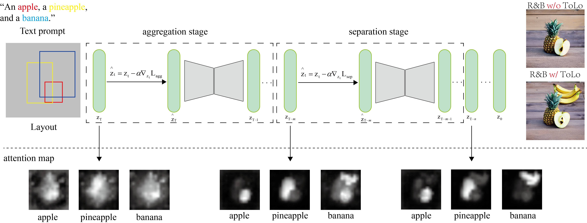

# ToLo
## Environment Setup
Run the following command to set up the environment:
```buildoutcfg
conda create -n ToLo python=3.8
conda activate ToLo
pip install -r requirements.txt
```
## Overview

## Inference

Run the following command to generate an example image:
```buildoutcfg
python inference_RnB.py general.save_path=./example_output 
```
## Acknowledgments
Our code is built upon [**R&B**](https://sagileo.github.io/Region-and-Boundary/), thanks for their awesome work.
